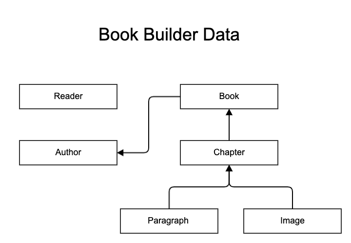

# Milestone 2. Technology Proven - Design

## PROJECT INFO

* [Software Project Plan - Book Builder](../Index.md)

* Other Roles - [Requirements.md](Requirements.md)
, [Design.md](Design.md)
, [Code.md](Code.md)
, [Test.md](Test.md)

* File: Milestone-2/Design.md

* URL: https://github.com/Mark-Seaman/Mark-Seaman.github.io/blob/master/BookBuilder/Milestone-2/Design.md

* Documents: Documents/swplan/BookBuilder

* Git Repo: Mark-Seaman.github.io

### Milestone 2. Technology Proven

Role: Designer - Design

Goal: Software Architecture

## Book Builder - Software Architecture

### Design Around User Stories

User Stories

* Reader - C R U
* Author - C R U
* Book - C R U
* Chapter - C R U D
* Paragraph - C R U D
* Image - C R U D

NOTE: Readers, Authors, and Book can be modified but not deleted.

### Design Architecture
* Apps = Data + Views
* The design for the app requires designing the data models
and the Views that will be implemented.

### Data Schema
* This diagram shows the key data models and how they fit together.
* The boxes represent data classes and database tables
* The arrows represent object references and database joins

### Data models

Data Classes and database tables

* Reader
    * user*
* Author
    * user*
    * name
* Book
    * author*
    * title
* Chapter
    * book*
    * title
    * order
* Paragraph
    * chapter*
    * text
    * order
* Image
    * chapter*
    * src
    * alt
    * order

    “*” makes a link to another table

### App Views

* Users
    * Register Author
    * Register Reader
    * User Admin
* Books
    * Create Book
    * List Books
    * Edit Book
    * Read Book
* Chapters
    * New Chapter
    * Edit Chapter
    * Read Chapter

### Phases Of Implementation

* 1 - Proof of concept
    * Milestone 2
    * Define the Data Models
    * Use admin views to simulate user stories
* 2 - Prototype
    * Milestone 3
    * Implement Custom View for User Stories
    * Users
        * Register Author
        * Register Reader
    * Books
        * Create Book
        * List Books
        * Edit Book
        * Read Book
    * Chapters
        * New Chapter
        * Edit Chapter
        * Read Chapter
* 3 - Core features
    * Streamline and improve UX
    * Deal with Errors
* 4 - Functionality complete
    * Build out logging
    * Fix errors
    * Performance
    * Usability testing and improvements
* 5 - Code Complete
    * Fix all defects
    * Implement 100% test coverage
